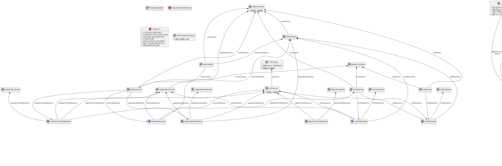

# Projet3_Partie_2:  Système de gestion des tâches pour les entreprises de construction

## Description du projet
Le projet Projet3_Partie_1 est un système de gestion de tâches pour des projets de construction. Il utilise divers design patterns pour gérer des tâches principales, sous-tâches, et calculer l'avancement et le score des tâches dans un environnement de gestion de projet de construction. L'application est conçue pour gérer une hiérarchie de tâches avec différents états (Planned, In Progress, Done) et des rôles différents pour les utilisateurs (Administrateurs, Membres).

## Fonctionnalités principales
Gestion des tâches et sous-tâches : Chaque tâche principale peut avoir des sous-tâches, et ces sous-tâches peuvent avoir un état distinct.

Calcul dynamique du score et de l'avancement : Le score de chaque tâche est calculé en fonction de ses sous-tâches et de leur état.

Gestion des états des tâches : Le passage d'une tâche à l'état DONE déclenche automatiquement la création et l'activation de la tâche suivante dans la séquence.

## Technologies utilisées
Java : Le projet est développé en Java pour une gestion modulaire des tâches.

Spring Boot : Utilisé pour les services backend et la gestion des états des tâches.

JPA (Hibernate) : Pour la persistance des données (tâches et sous-tâches).

CSV : Les données de tests sont chargées à partir de fichiers CSV pour simuler un environnement de gestion de projet réaliste.

## Design Patterns Utilisés
1. Composite Pattern (Patron Composite)
Le Composite Pattern est utilisé pour gérer la hiérarchie des tâches et sous-tâches. Chaque tâche peut être une tâche principale ou une sous-tâche, et le comportement est traité de manière uniforme. Cela permet de gérer la structure hiérarchique de manière fluide.

Exemple : La classe Tache contient une liste de sous-tâches qui peuvent être ajoutées, modifiées ou supprimées.

2. State Pattern (Patron State)
Le State Pattern est utilisé pour gérer l'état des tâches. Chaque tâche peut être dans un état particulier (Planned, In Progress, Done), et ce patron permet de gérer le changement d'état de manière flexible.

Exemple : Les méthodes comme setEtat() dans la classe Tache gèrent la transition d'état d'une tâche, et les sous-tâches sont mises à jour en conséquence.

3. Observer Pattern (Patron Observateur)
Le Observer Pattern permet à une tâche principale de surveiller ses sous-tâches. Lorsqu'une sous-tâche change d'état, la tâche principale est mise à jour en conséquence.

Exemple : Lorsqu'une sous-tâche atteint l'état DONE, la méthode checkAndActivateNext() dans Tache vérifie l'état de toutes les sous-tâches et active la tâche suivante si nécessaire.

4. Factory Pattern (Patron de Fabrique)
Bien que ce patron ne soit pas explicitement visible dans le code, un Factory Pattern peut être utilisé pour créer différentes sortes de tâches (BASIC, MEDIUM, PROFESSIONNEL) en fonction des besoins du projet, avec des comportements spécifiques pour chaque type.

Exemple : Une classe TacheFactory pourrait être utilisée pour créer des instances de différentes tâches selon le type spécifié.

## Architecture

Le projet suit une architecture en couches :

- Controller : API REST
- Service : logique métier
- Repository : accès aux données
- Model : entités JPA

Cette architecture permet une bonne séparation des responsabilités.

## Installation
Clonez le projet depuis GitHub :

bash
git clone https://github.com/djGitDev/Projet_MGL7760.git
Importez le projet dans votre IDE  (comme VScode,IntelliJ IDEA ou Eclipse).

Assurez-vous que vous avez Java 17 ou supérieur installé.

Si nécessaire, installez les dépendances avec Maven :

bash
mvn install
Lancez l'application avec la commande suivante :

bash
mvn spring-boot:run

## Utilisation
Une fois le serveur démarré, vous pouvez interagir avec les tâches via l'API REST exposée par Spring Boot. Voici un exemple de requête pour récupérer toutes les tâches, vous pouvez les tester en utilsant Postman :

GET http://localhost:8080/api/taches

Le système permet de :

1. Ajouter sous tâches a tâches

2. Avant l'ajout dans la base de données

3. Aprés l'ajout dans la base de données

4. Modifier l'état d'une tâche

5. Avant changement d'état d'une tâche

6. Aprés changement d'état d'une tâche

7. Calculer le score d'une tâche

8. Calculer l'avencement d'une tâche

## Diagramme UML

## Tests

Le projet contient une suite de tests automatisés :

- 44 tests unitaires
- 0 erreurs
- 0 échecs

Pour exécuter les tests :
bash
mvn clean test

## Pipeline CI/CD
Le projet utilise GitHub Actions pour automatiser :

- Build du projet
- Exécution des tests
- Analyse de qualité avec SonarCloud
- Vérification de la couverture de code
- Génération de documentation

Le pipeline est déclenché à chaque :
- push
- pull request

## Workflow de développement

1. Créer une branche (SCRUM-XX)
2. Développer la fonctionnalité
3. Exécuter les tests localement :
    bash
    mvn clean test
4. Commit et push
5. Vérifier le pipeline CI
6. Créer une Pull Request
7. Validation et merge

## Rapport d’évaluation d’impact
Voir : docs/impact-evaluation.md

## Auteurs et reconnaissance

### Équipe TP MGL7760
- Azza Gatfa
- Ouedraogo Alex Ali Fulgence 
- Mohamed djawad Abi Ayad 

### Projet original
Ce projet est basé sur un travail réalisé dans un autre cours, développé initialement par :
- Lamia Griou
- Azza Gatfa

### Contributions (TP actuel)

Dans le cadre de ce projet, l'équipe a travaillé sur :

- Mise en place d’un pipeline CI complet avec GitHub Actions :
  - Build (compilation Maven)
  - Exécution des tests automatisés
  - Analyse de qualité avec SonarCloud
  - Vérification de la couverture de code
  - Génération de rapports

- Configuration des outils de qualité :
  - Intégration de SonarCloud avec Quality Gate
  - Configuration des linters
  - Correction des issues détectées

- Développement de la stratégie de tests :
  - Réalisation des tests unitaires
  - Réalisation des tests d’intégration
  - Validation locale et dans le pipeline CI

- Mise en place des contrôles locaux :
  - Configuration du hook pré-commit en local
  - Vérification automatique avant commit

- Automatisation de la documentation :
  - Génération automatique du diagramme UML avec PlantUML
  - Intégration du diagramme dans le README

- Amélioration de la documentation technique :
  - README structuré avec badges
  - Instructions d’installation
  - Description de l’architecture
  - Workflow de développement
  
## Licence
Ce projet est sous licence MIT.

## Statut du projet
Le développement du projet est en cours. Actuellement, les fonctionnalités principales telles que la gestion des tâches et la gestion des états sont opérationnelles, mais des améliorations peuvent être apportées, notamment pour l'interface utilisateur.