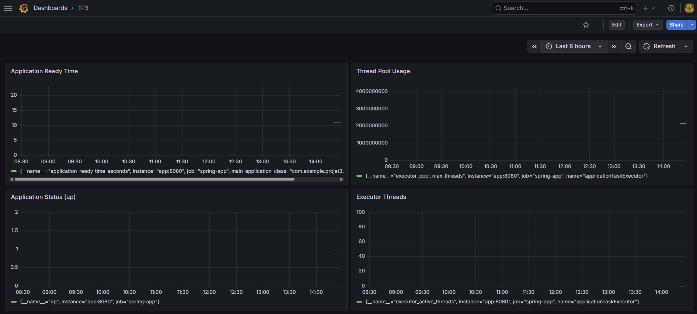
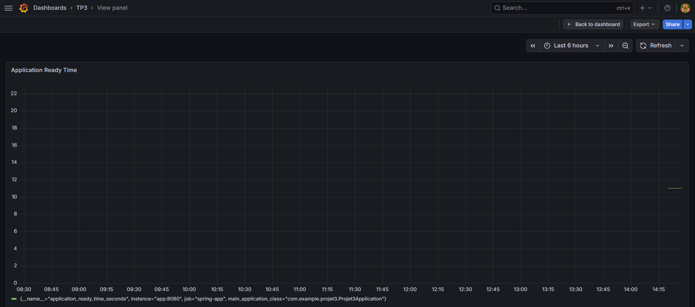

# Rapport d’évaluation d’impact

## 1. Introduction

Cette section vise à évaluer l’impact de la mise en place d’un système de déploiement automatisé et de monitoring dans le projet.

L’objectif est d’analyser comment ces outils permettent d’améliorer la qualité du logiciel, la visibilité du système ainsi que l’efficacité du processus de développement.

## 2. Outils et technologies

Le projet intègre plusieurs outils DevOps :

- Docker et Docker Compose pour le déploiement automatisé
- Prometheus pour la collecte des métriques
- Grafana pour la visualisation et le monitoring

Ces outils permettent d’assurer un déploiement cohérent et de surveiller le comportement de l’application en temps réel.

## 3. Métriques analysées

Les métriques suivantes ont été utilisées pour évaluer les performances du système :

- **application_ready_time_seconds** : mesure le temps nécessaire pour que l’application soit prête
- **application_started_time_seconds** : indique le temps de démarrage
- **executor_pool_max_threads** : représente le nombre maximal de threads disponibles
- **executor_active_threads** : indique le nombre de threads actifs
- **up** : permet de vérifier si l’application est en fonctionnement

Ces métriques fournissent des informations sur la performance, la stabilité et l’utilisation des ressources.

## 4. Tableau de bord de monitoring

Le tableau de bord Grafana permet une visualisation en temps réel des métriques système et applicatives collectées par Prometheus.

Il permet aux développeurs de surveiller le comportement du système, de détecter les anomalies et d’analyser les performances de manière efficace.

- **Figure 1** : Tableau de bord global présentant les principales métriques du système telles que l’état de l’application, l’utilisation des threads et le temps de disponibilité.
- **Figure 2** : Vue détaillée de la métrique *application_ready_time_seconds*, illustrant la performance de démarrage de l’application.

Ces visualisations améliorent l’observabilité du système et facilitent la détection rapide des problèmes ainsi que la prise de décision.

Les graphiques montrent que l’application reste stable dans le temps et que les ressources sont utilisées de manière contrôlée.

Cependant, en raison du faible volume d’activité, certaines variations de performance restent peu visibles.

Ces métriques montrent que le système de monitoring est correctement configuré et opérationnel, même en présence d’une faible activité.

## 5. Évaluation de l’impact (Avant et Après)

| Aspect                  | Avant implémentation | Après implémentation |
|------------------------|---------------------|----------------------|
| Déploiement            | Manuel              | Automatisé avec Docker |
| Monitoring             | Non disponible      | Temps réel avec Grafana |
| Détection d’erreurs    | Difficile           | Plus rapide et efficace |
| Visibilité du système  | Limitée             | Élevée |

Ces résultats montrent une amélioration significative de la qualité du processus de développement. 

L’automatisation du déploiement réduit les risques d’erreurs humaines, tandis que le monitoring en temps réel améliore la réactivité face aux incidents.

## 6. Analyse

L’intégration des outils de déploiement et de monitoring a permis d’améliorer significativement l’observabilité du système.

Les développeurs peuvent désormais suivre le comportement de l’application en temps réel, ce qui facilite la détection des anomalies et l’analyse des performances.

Le déploiement automatisé réduit les erreurs humaines et garantit une meilleure cohérence entre les environnements.

Même si l’activité du système est actuellement faible, l’infrastructure de monitoring est correctement configurée et pleinement fonctionnelle.

Ces résultats confirment que l’intégration des outils DevOps améliore non seulement la surveillance mais aussi la qualité globale du cycle de développement logiciel.

## 7. Analyse coûts et bénéfices

La mise en place de ces outils nécessite un effort initial en termes de configuration et de temps.

Cependant, les bénéfices sont importants :

- Amélioration de la fiabilité du système
- Détection plus rapide des problèmes
- Meilleure visibilité sur les performances
- Gain de temps dans le processus de développement

Ainsi, le retour sur investissement est jugé élevé.

Ces bénéfices démontrent l’importance des pratiques DevOps dans l’amélioration continue des systèmes logiciels.

## 8. Limites

Une des limites de cette évaluation est le faible volume d’activité du système, ce qui réduit la visibilité de certaines variations de performance.

Cependant, le système de monitoring est opérationnel et prêt à être utilisé dans un contexte réel.

## 9. Conclusion

L’intégration des outils Docker, Prometheus et Grafana a permis d’améliorer significativement la qualité globale du système.

Ces outils offrent une meilleure visibilité, facilitent l’analyse des performances et rendent le processus de déploiement plus efficace.

Ils contribuent ainsi à une amélioration globale de la qualité logicielle et de la maintenabilité du système.

Ce type d’infrastructure est essentiel dans des environnements de production modernes où la disponibilité et la performance sont critiques.