# Rapport d’évaluation d’impact

## 1. Introduction

Cette section vise à évaluer l’impact de la mise en place d’un système de déploiement automatisé et de monitoring dans le projet.

L’objectif est d’analyser comment ces outils permettent d’améliorer la qualité du logiciel, la visibilité du système ainsi que l’efficacité du processus de développement.

## 2. Outils et technologies

Le projet intègre plusieurs outils issus des pratiques DevOps :

- Docker et Docker Compose pour le déploiement automatisé
- Prometheus pour la collecte des métriques
- Grafana pour la visualisation et le monitoring

Ces outils permettent d’assurer un déploiement cohérent et de surveiller le comportement de l’application en temps réel.

## 3. Métriques analysées

Les métriques suivantes ont été utilisées :

- **application_ready_time_seconds** : temps pour que l’application soit prête
- **application_started_time_seconds** : temps de démarrage
- **executor_pool_max_threads** : nombre maximal de threads
- **executor_active_threads / jvm_threads_live_threads** : threads actifs
- **up** : état de l’application (1 = en ligne, 0 = hors ligne)

## 4. Tableau de bord de monitoring

Le tableau de bord Grafana permet de visualiser les métriques en temps réel et de surveiller le comportement du système.

###  Vue globale

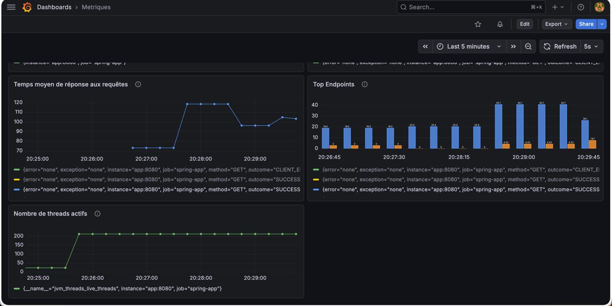

Cette vue regroupe les principales métriques du système.

## 4.1 Monitoring avancé et alertes

###  Nombre d’erreurs 404

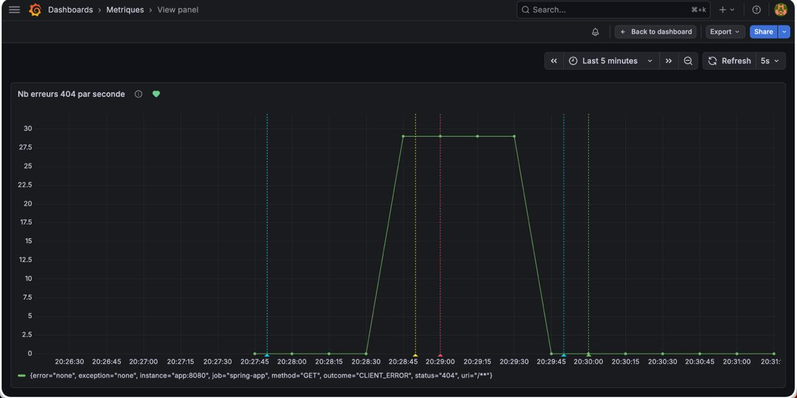

- La courbe verte représente le nombre d’erreurs
- La ligne rouge verticale indique le déclenchement de l’alerte (seuil > 15 erreurs/sec)
- La ligne verte pointillée indique la fin de l’alerte

 Permet de détecter rapidement des anomalies

###  État de l’application

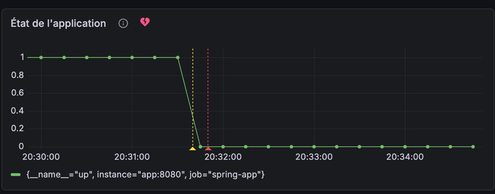

- Valeur **1** → application en ligne  
- Valeur **0** → application hors ligne  

Alertes :
- Ligne jaune → détection du problème
- Ligne rouge → alerte déclenchée
- Icône cœur → état global du système

###  Nombre de requêtes par seconde

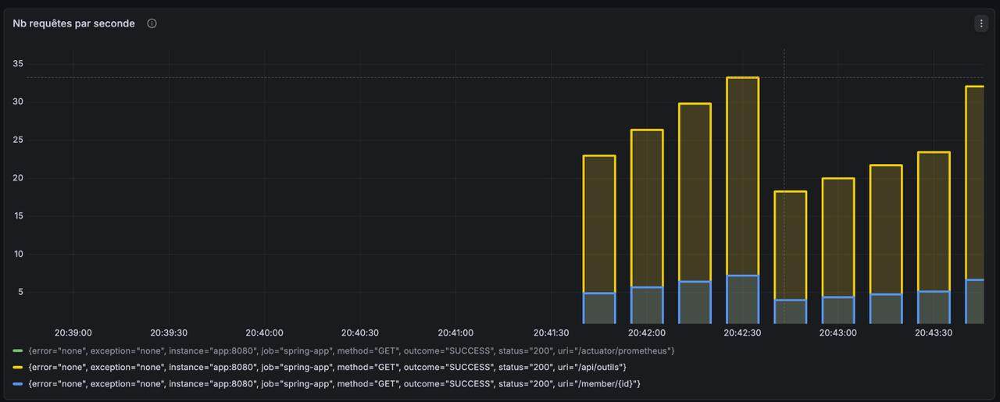

- Montre le trafic du système
- Permet d’analyser la charge

Le nombre de requêtes augmente lors de la simulation, ce qui montre la capacité du système à gérer une charge variable.

###  Temps moyen de réponse

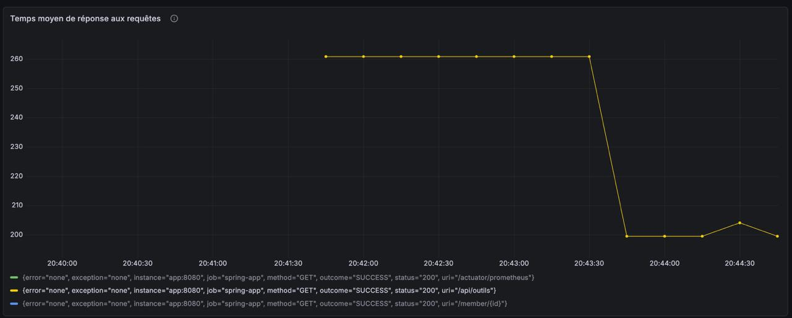

- Mesure la performance des requêtes
- Permet d’identifier les ralentissements

###  Nombre de threads actifs

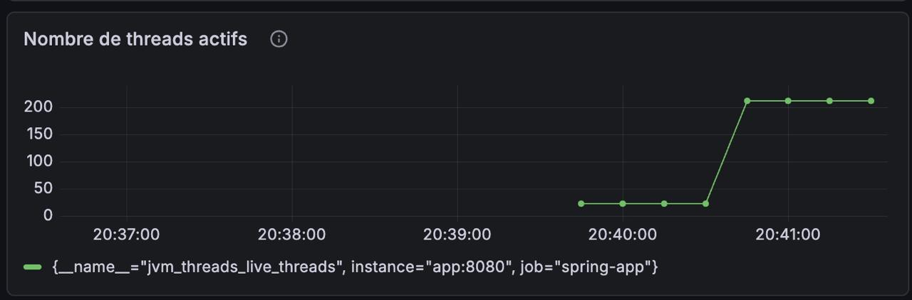

- Indique l’utilisation des ressources
- Permet de détecter une surcharge

Le nombre de threads actifs permet de comprendre l’utilisation interne des ressources et d’identifier une éventuelle surcharge.

### Taux d’utilisation du CPU

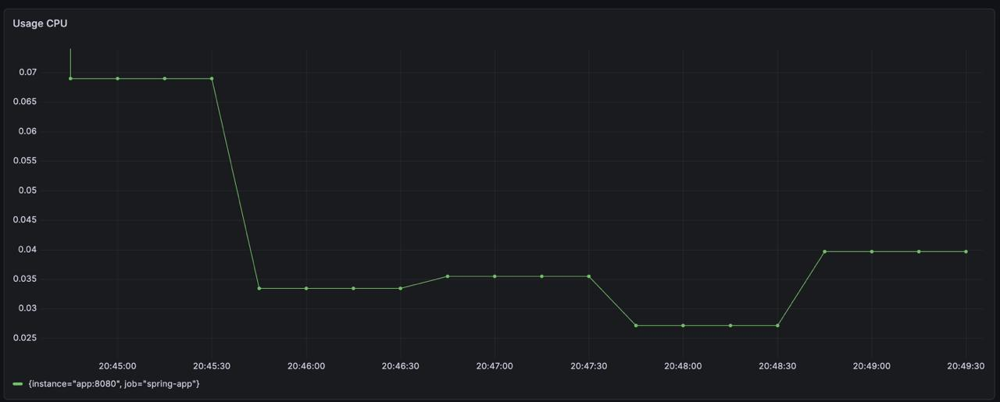

- Représente l’utilisation du processeur par l’application
- Permet d’analyser la consommation des ressources système
- Une variation peut indiquer une charge ou une activité particulière du système

On observe une variation du taux d’utilisation du CPU, ce qui reflète l’activité du système et la simulation de charge effectuée.

###  Top Endpoints

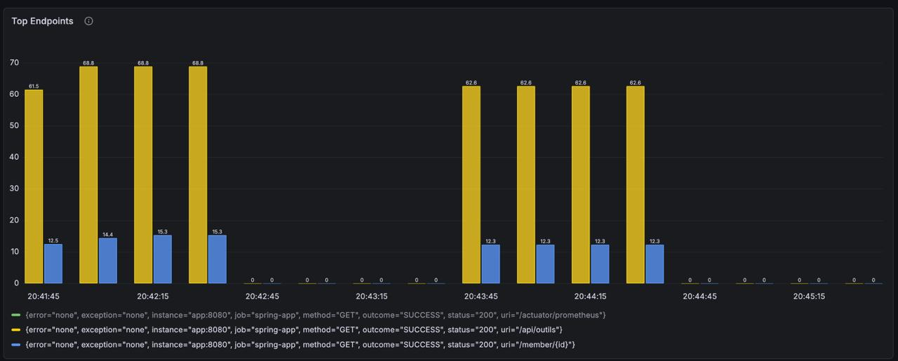

- Montre les routes API les plus utilisées
- Exemple : `/member/1`, `/api/outils`

Utile pour analyser l’usage de l’application

###  Vue globale des alertes

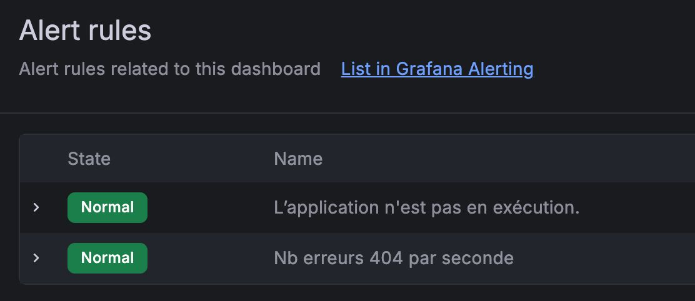

- Permet de voir l’état global des alertes
- Ici : aucune alerte active

###  Simulation de charge

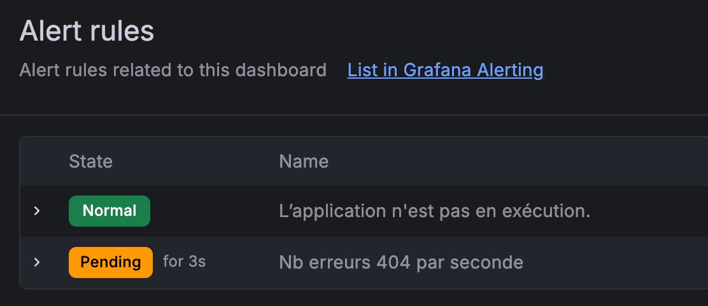

- Simulation de requêtes (spam)
- Augmentation progressive des erreurs

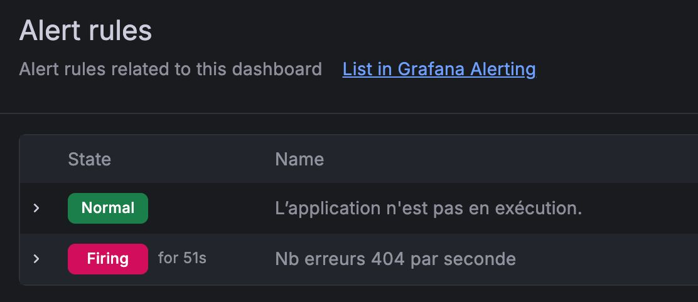

- L’alerte est déclenchée lorsque le seuil est dépassé

Cela montre que le système de monitoring fonctionne correctement

## 5. Évaluation de l’impact

| Aspect                  | Avant | Après |
|------------------------|------|------|
| Déploiement            | Manuel | Automatisé |
| Monitoring             | Aucun | Temps réel |
| Détection d’erreurs    | Difficile | Rapide |
| Visibilité             | Faible | Élevée |
| Réactivité             | Lente | Immédiate |

## 6. Analyse

L’intégration de Docker, Prometheus et Grafana a permis :

- Une meilleure observabilité du système
- Une détection rapide des anomalies
- Une analyse en temps réel des performances
- Une automatisation du déploiement

Les alertes permettent une réaction proactive aux incidents.

Les métriques collectées et les alertes mises en place permettent non seulement de détecter les anomalies, mais aussi d’anticiper les problèmes avant qu’ils n’impactent les utilisateurs.

## 7. Coûts et bénéfices

### Coûts
- Temps de configuration
- Complexité initiale

### Bénéfices
- Fiabilité améliorée
- Gain de temps
- Monitoring en temps réel
- Meilleure prise de décision

Le retour sur investissement est élevé

## 8. Limites

- Faible volume de données
- Simulation artificielle des charges

Cependant, l’infrastructure est prête pour un usage réel.

## 9. Conclusion

L’intégration des outils DevOps a considérablement amélioré la qualité du système.

Le monitoring permet :
- une meilleure visibilité
- une détection rapide des problèmes
- une amélioration des performances

Le système est désormais robuste, observable et maintenable.